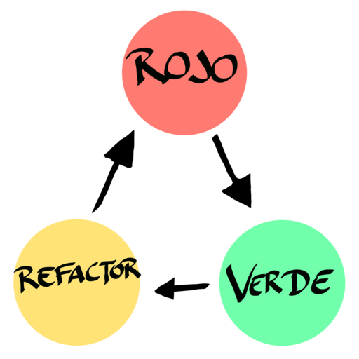

import Link from '../components/Link';

# Añadiendo nuevos componentes

## Especificaciones
Queremos crear un nuevo componente de de búsqueda. 

## ¿Qué es TDD?

En resumidas cuentas esto es TDD.

## Cómo testear el componente
Dejar claro que los tests van sobre cómo se comportan los componentes, qué es lo
que hacen y cual es su función

https://react-testing-examples.com/jest-rtl/

Jest Extend DOM

React Testing Library Approach

HACER LA SOLUCIÓN DEL SEARCH CON UN WRAPPER PARA PODER HACERLO REALMENTE UNITARIO

<Link text={'Cypress'} to={'https://docs.cypress.io/guides/references/best-practices.html'}/>

